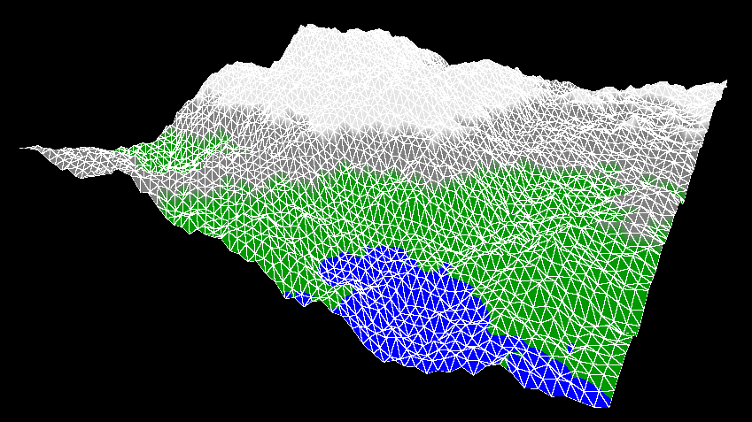

# Java-Projects
Hello there! \
This Repository is full of my little java-projects. Have fun looking around! :D \
Here is an Overview:
- [Diamond-Square Algorithm](#diamond-square-algorithm-) (Terrain Mesh Generation)

## Diamond-Square Algorithm [↗](https://github.com/NicoNoell/Java-Projects/tree/main/Diamond-Square-Algorithm/src)
The Diamond-Square Algorithm presents a very simple technique for generating natural-ish looking terrain. 
#### How it works:
You start with four vertices arranged as a square and assign each one a random height. Then comes the **Diamond Step**, 
during which you compute the average of the four corners and add a center vertex with a height equal to that average ± 
a random offset (the "variance"). During the follow-up **Square Step**, vertices are inserted at the edge of the square 
similar to the Diamond Step, such that a 
square grid is restored. If you repeat this process recursively a sufficient number of times reducing the variance as you go, you 
get natural terrain looking something like this:   

  

#### How to color it:
Naturally though, the programm only produces an .obj-file, which can be viewed with any 3d viewer of your choice. 
To make it more realistic and colorful, I used [ShaderLabWeb](https://vmwestermann10.in.tum.de), a web shader 
that's more or less intuitive to use. There, you just need to upload the .obj-file and can then test your shader-writing 
Skills :).

#### Further Resources
If you wish to learn more about this stuff, here are some links:
- [About the Diamond-Square Algorithm (Wikipedia)](https://en.wikipedia.org/wiki/Diamond-square_algorithm)
- [About the .obj File format (Wikipedia)](https://en.wikipedia.org/wiki/Wavefront_.obj_file)